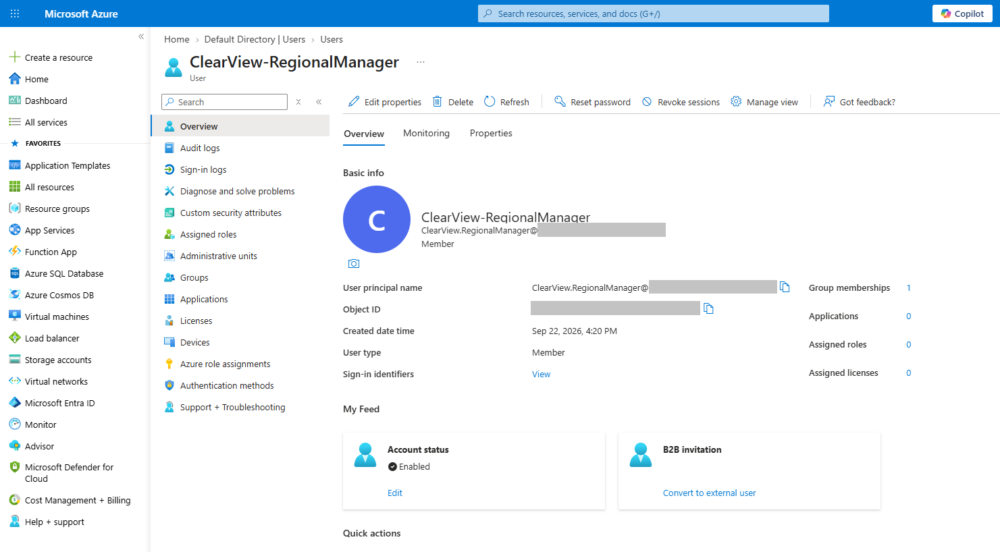
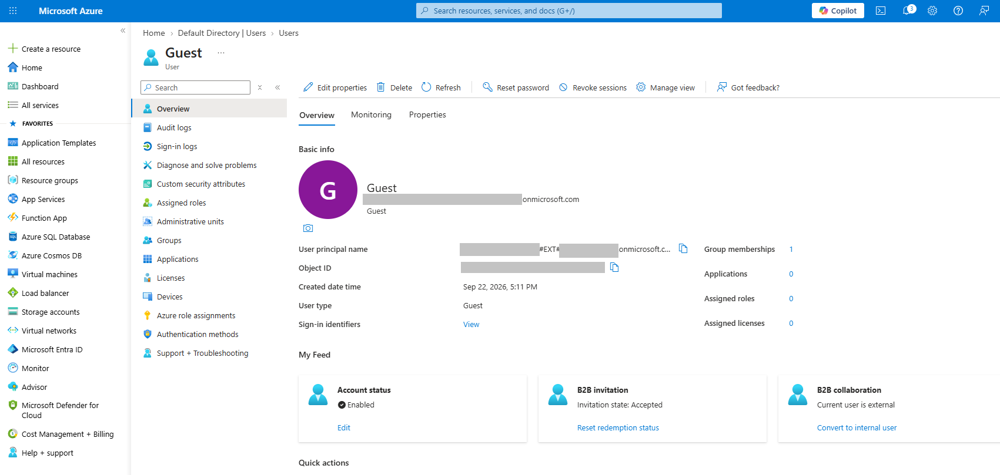
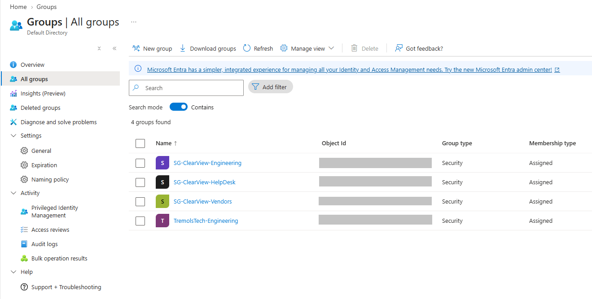
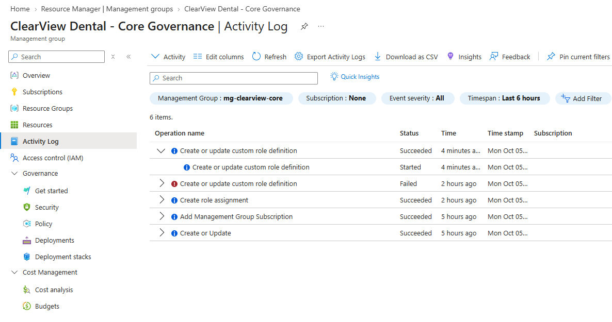
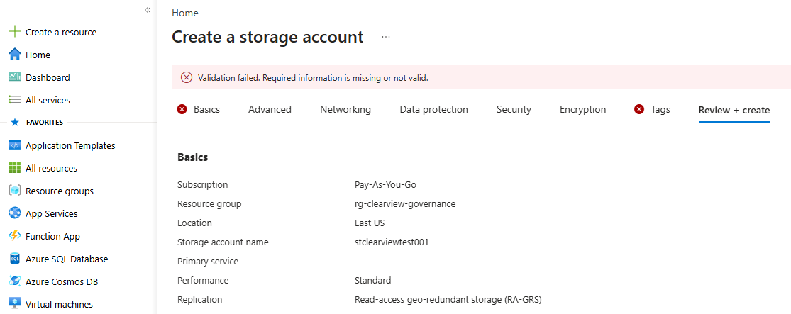
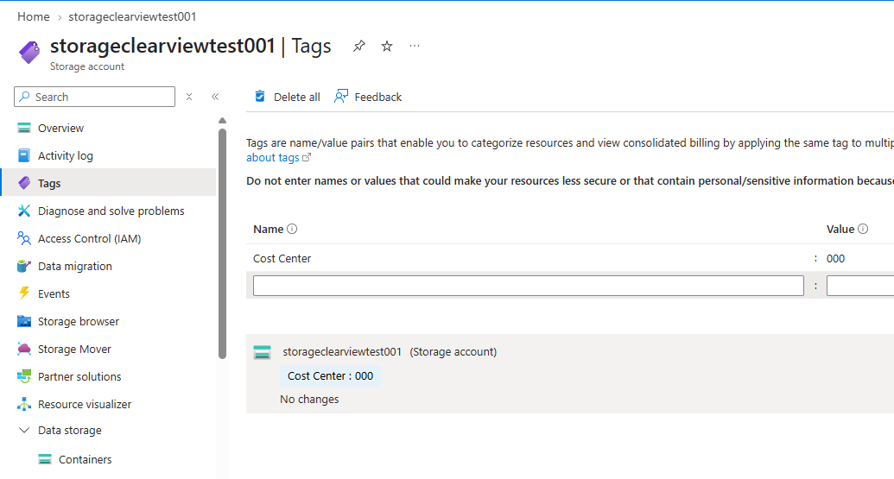
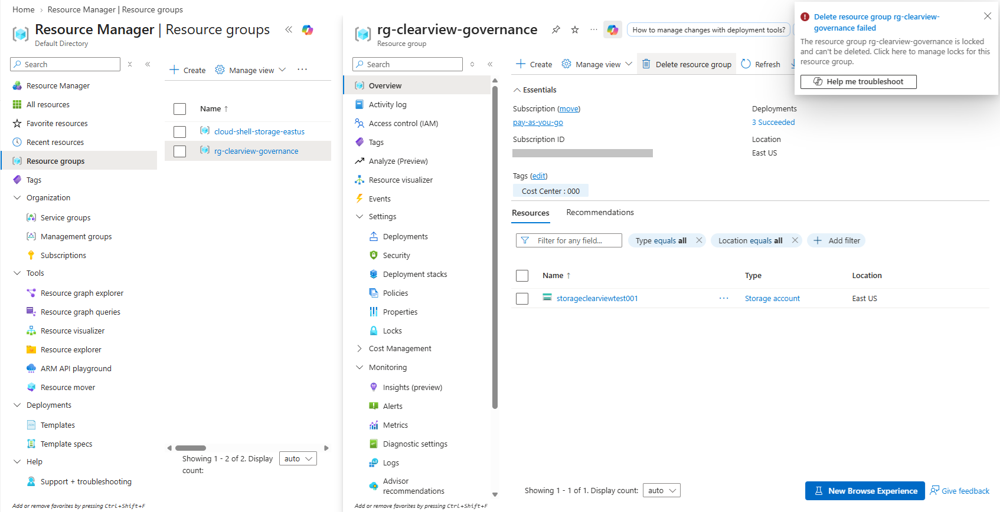

# Lab 01: Identity & Governance

> Part of the [AZ-104 Azure Administrator Journey](../README.md). ClearView Dental Associates and all names, accounts, and data are fictional. This lab is based on Microsoft's AZ-104 learning content and is not affiliated with Microsoft.

**Exam domain:** Manage Azure identities and governance | **Outcome:** A secure identity and governance baseline that later resources inherit.

## Contents

1. [Business Scenario](#business-scenario)
2. [Walkthrough](#walkthrough)
3. [Results, Challenges & What I Learned](#results-challenges--what-i-learned)
4. [Cleanup](#cleanup)

---

## Business Scenario

Tremols Tech, an early-stage MSP, is onboarding **ClearView Dental Associates**, a dental group with multiple clinics and about 180 staff, into Microsoft Azure.

Before any compute, networking, or storage is deployed, Tremols Tech needs a secure baseline: who can access what, how subscriptions are organized, how resources are governed, and how accidental deletion is prevented. Every workload ClearView migrates later (VMs, storage, networking, analytics) will inherit these controls, so mistakes made here compound over time.

**What this lab covers**

- Entra ID users, guests, and groups
- Management groups
- RBAC and custom roles
- Azure Policy
- Tagging
- Resource locks

**Prerequisites**

| Requirement | Details |
|---|---|
| Azure subscription | Pay-As-You-Go |
| Entra ID role | Global Administrator |
| Azure role | Owner on the subscription and management group |
| Tools | Azure Portal (steps below), with PowerShell and CLI equivalents for reference |

---

## Walkthrough

All steps were performed in the **Azure Portal**. PowerShell and CLI equivalents are included where they apply. Screenshots are redacted of IDs and emails and stored in `./images/`.

### Part 1: Identity (Users, Guests & Groups)

**Why:** Tremols Tech engineers and outside dental software vendors need identities before they can support the migration.

**1. Created an internal user**
- Added a user representing a ClearView Regional Manager and set display name, job title, department, and usage location (usage location is required before a license can be assigned).



**2. Invited an external guest**
- Invited an external imaging software consultant to simulate a B2B scenario. The guest appeared in Entra ID as a Guest user type and received an email invitation.



**3. Created security groups** (assigned membership)

- **ClearView - Engineering:** I set myself as owner and added the internal user and the guest
- **ClearView - Help Desk:** used for the role assignment in Part 2

> Dynamic membership requires Entra ID P1/P2 and suits MSP environments, for example `user.department -eq "Engineering"`. This lab used assigned membership.



### Part 2: Governance (Management Groups & RBAC)

**Why:** ClearView wants consistent access control across subscriptions, so permissions are applied at the right scope instead of resource by resource.

**1. Created a management group**

| Setting | Value |
|---|---|
| ID | `mg-clearview-core` (cannot be changed after creation) |
| Display name | ClearView Dental - Core Governance |

Management groups give centralized RBAC, centralized Azure Policy, and inheritance to subscriptions beneath them.
> I moved my Pay-As-You-Go subscription under this group so assignments and policies apply to it.

<details>
<summary>PowerShell / CLI equivalent</summary>

```powershell
New-AzManagementGroup -GroupName mg-clearview-core -DisplayName "ClearView Dental - Core Governance"
```

```bash
az account management-group create --name mg-clearview-core --display-name "ClearView Dental - Core Governance"
```
</details>

**2. Assigned a built-in role**
- Assigned **Virtual Machine Contributor** to the Help Desk group at the management group scope. It allows VM management without guest OS access or network and storage configuration, which fits MSP support work.

> This scope covers every current and future subscription under the group. That is fine for a lab. In production I would scope it to a subscription or resource group.

**3. Created a custom role**
- Cloned **Support Request Contributor** and trimmed it for least privilege.

| Setting | Value |
|---|---|
| Role name | ClearView Support Request Contributor |
| Actions | Create and manage support tickets |
| NotActions | `Microsoft.Support/register/action` (blocks provider registration) |
| Assignable scope | `mg-clearview-core` |

**4. Reviewed role activity**
- Used the **Activity Log** to confirm the role definition and assignment events, which is the audit trail an MSP needs for compliance reviews.



### Part 3: Governance Enforcement (Policy, Tags & Locks)

**Why:** An internal audit found resources with no owner, project, or cost center metadata. Consistent tagging supports cost visibility, automation, and HIPAA-aligned governance practices.

**1. Tagged a resource group**
- Created `rg-clearview-governance` with the tag `CostCenter: 000`. CostCenter was the pilot tag; a full rollout would also enforce Owner and Project.

<details>
<summary>PowerShell / CLI equivalent</summary>

```powershell
New-AzResourceGroup -Name rg-clearview-governance -Location EastUS -Tag @{ CostCenter = "000" }
```

```bash
az group create --name rg-clearview-governance --location EastUS --tags CostCenter=000
```
</details>

**2. Enforced tagging (Deny)**
- Assigned the built-in policy **Require a tag and its value on resources** to the resource group. Creating a storage account without the tag failed with a policy violation.



**3. Inherited tags automatically (Modify)**
- Removed the Deny assignment so the policies would not conflict, then assigned **Inherit a tag from the resource group if missing** with a system-assigned managed identity. The portal granted that identity the **Contributor** role on the resource group. The new storage account (`storageclearviewtest001`) was not tagged at creation, so I ran a remediation task, and after it completed the `CostCenter: 000` tag appeared.



**4. Applied a resource lock**
- Added a **Delete** lock to the resource group. Deleting the group failed with a lock error.



<details>
<summary>PowerShell / CLI equivalent</summary>

```powershell
New-AzResourceLock -LockName DeleteLock -LockLevel CanNotDelete -ResourceGroupName rg-clearview-governance
```

```bash
az lock create --name DeleteLock --lock-type CanNotDelete --resource-group rg-clearview-governance
```
</details>

---

## Results, Challenges & What I Learned

**Results**

- Internal user, guest user, and two security groups created in Entra ID
- Management group created, with the subscription moved under it and Virtual Machine Contributor assigned to the Help Desk group
- Custom role built from a clone of a built-in role
- Deny policy enforced tagging, then a Modify policy with a remediation task automated it
- Delete lock blocked removal of the governance resource group

**Challenges**

- The Modify policy did not tag the new storage account at creation. I confirmed the assignment scope, the `CostCenter` parameter, and the managed identity's Contributor role, then ran a remediation task
- The remediation task stayed on "Evaluating" for several minutes before it applied the tag
- Policy assignments can take up to ~30 minutes to take effect, so testing too early gives misleading results
- The Delete lock blocks cleanup, so it has to be removed first
- I deleted the management group before finishing the lab, so I recreated it, moved the subscription back under it, and reassigned the Virtual Machine Contributor role and custom role scope

**What I learned**

- Assign roles to groups, not individuals
- RBAC controls *who* can act. Policy controls *what state* resources may be in. Locks protect against deletion or change regardless of role
- Even an Owner cannot delete a locked resource until the lock is removed, and only Owners and User Access Administrators can remove it
- Tagging is the foundation for cost management and automation
- **MSP lens:** in production I would manage customer tenants with Azure Lighthouse instead of guest accounts, require MFA and Conditional Access for admins, and use PIM for just-in-time elevation. Governance tooling supports HIPAA-aligned practices but does not make an environment compliant by itself; a BAA with Microsoft is a separate requirement

---

## Cleanup

Remove the lock **first**, or the resource group deletion will fail. The management group can only be deleted once it has no subscriptions or child groups.

**Portal**

1. Remove the Delete lock on `rg-clearview-governance`
2. Delete the resource group
3. Remove the policy assignments
4. Remove role assignments and delete the custom role
5. Move any subscriptions out of the management group, then delete it
6. Delete the test user, guest user, and security groups

**PowerShell**

```powershell
Get-AzResourceLock -ResourceGroupName rg-clearview-governance | Remove-AzResourceLock -Force
Remove-AzResourceGroup -Name rg-clearview-governance -Force
Remove-AzManagementGroup -GroupName mg-clearview-core
```

**Azure CLI**

```bash
az lock delete --name DeleteLock --resource-group rg-clearview-governance
az group delete --name rg-clearview-governance --yes
az account management-group delete --name mg-clearview-core
```

---

⬅️ [Back to main README](../README.md) | ➡️ Next: Lab 02 - Compute & Virtual Machines
